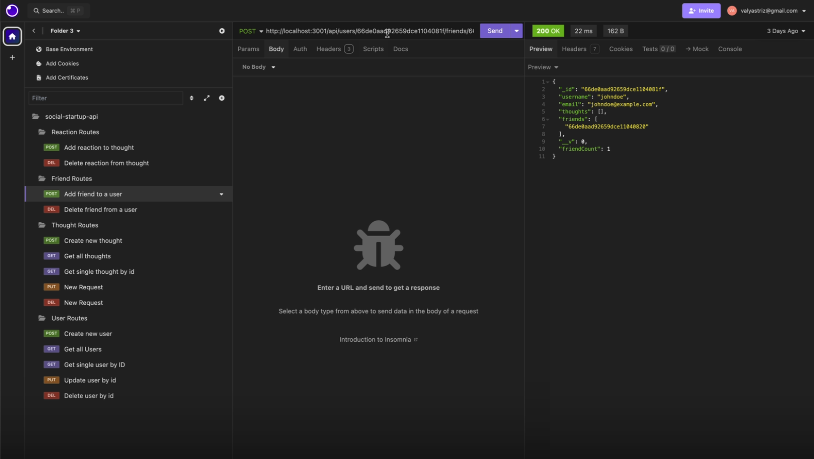
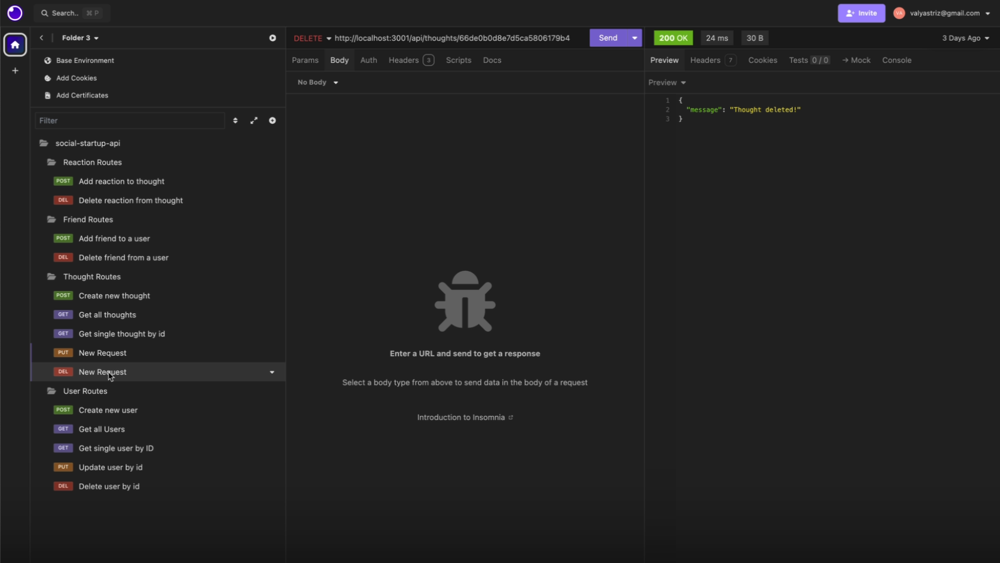
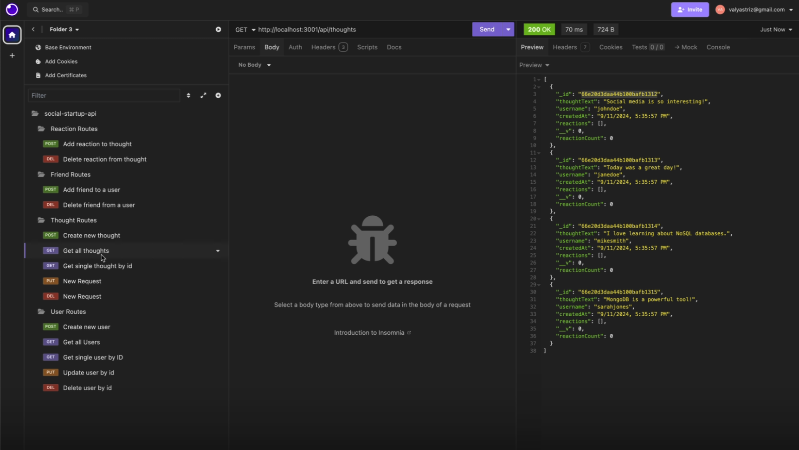
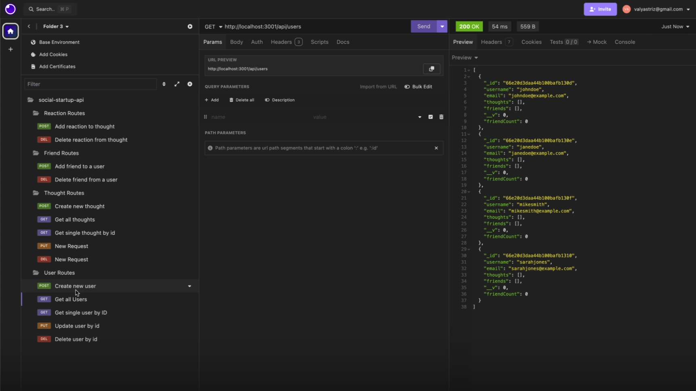
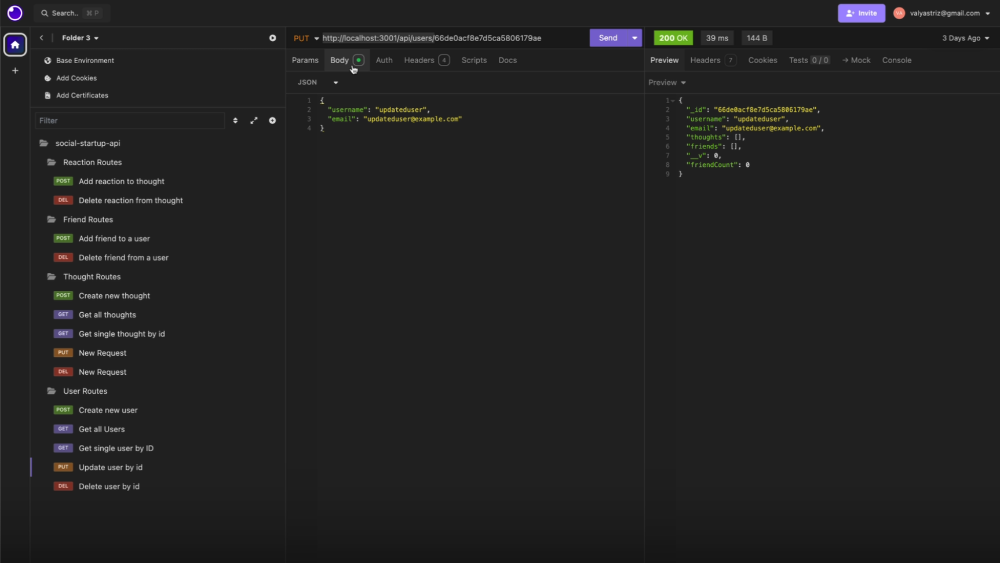

# Social Network API

## Description

This is a Social Network API built using MongoDB, Mongoose, Express.js, and Node.js. This application provides the ability to manage users, their thoughts, reactions to thoughts, and friend lists. The API uses a NoSQL database (MongoDB) to handle large amounts of unstructured data efficiently.

The application is not deployed but can be tested using Insomnia or Postman. A walkthrough of the API's functionality is demonstrated below using sample routes.

## Table of Contents
- [Installation](#installation)
- [Usage](#usage)
- [API Routes](#api-routes)
- [Screenshots](#screenshots)
- [Repository](#repository)

## Installation

1. Clone the repository to your local machine:
   ```
   git clone https://github.com/valyastriz/social-startup-api.git
   ```

2. Install the required dependencies:
   ```
   npm install
   ```

3. Ensure MongoDB is installed and running locally.

4. Create a `.env` file with the following content:
   ```
   MONGODB_URI=mongodb://localhost:27017/socialnetwork
   ```

5. Seed the database by running the following command:
   ```
   node seed
   ```

6. Start the server:
   ```
   node index.js
   ```

## Usage

The API can be tested using Insomnia or Postman. It includes the following routes:

### User Routes

- **GET** `/api/users` - Get all users
- **GET** `/api/users/:userId` - Get a single user by ID
- **POST** `/api/users` - Create a new user
- **PUT** `/api/users/:userId` - Update a user by ID
- **DELETE** `/api/users/:userId` - Delete a user by ID

### Thought Routes

- **GET** `/api/thoughts` - Get all thoughts
- **GET** `/api/thoughts/:thoughtId` - Get a single thought by ID
- **POST** `/api/thoughts` - Create a new thought
- **PUT** `/api/thoughts/:thoughtId` - Update a thought by ID
- **DELETE** `/api/thoughts/:thoughtId` - Delete a thought by ID

### Friend Routes

- **POST** `/api/users/:userId/friends/:friendId` - Add a friend to a user's friend list
- **DELETE** `/api/users/:userId/friends/:friendId` - Remove a friend from a user's friend list

### Reaction Routes

- **POST** `/api/thoughts/:thoughtId/reactions` - Add a reaction to a thought
- **DELETE** `/api/thoughts/:thoughtId/reactions/:reactionId` - Remove a reaction by reaction ID

## Screenshots

- **Add Friend**: 
- **Delete Thought**: 
- **Get All Thoughts**: 
- **Get All Users**: 
- **Get User by ID**: 
- **Update User**: 

## Repository

Check out the GitHub repository for this project:
[Social Network API GitHub Repository](https://github.com/valyastriz/social-startup-api.git)

